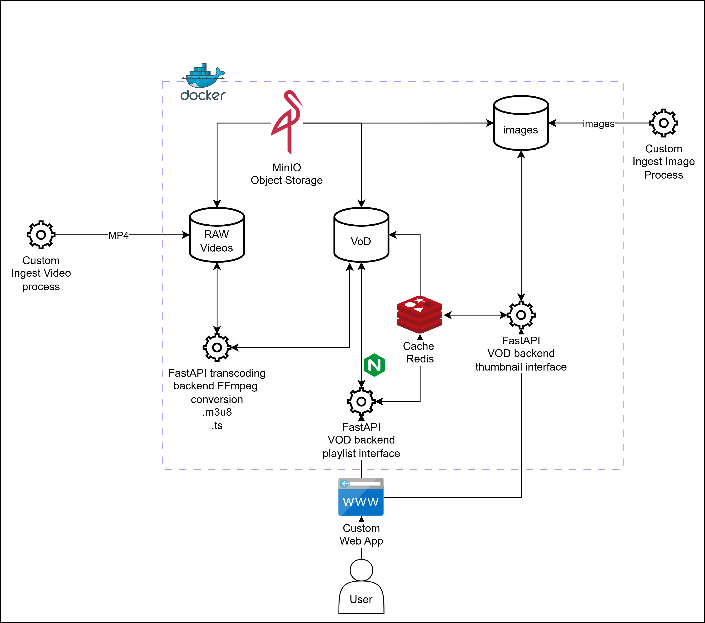

# Media Asset Management (MAM)
Media Asset Management (MAM) solution that fully integrates both transcoding and Image/Video-On-Demand features using OpenSource solutions

---

# Video Transcoding and VoD FastAPI Services

This repository provides an all-in-one solutions that fully integrates through ```docker-compose``` two FastAPI-based microservices for handling video transcoding and video/image streaming (VoD - Video on Demand). The system integrates with **MinIO** for object storage, **FFmpeg** for video conversion to HLS format, and **Redis** for playlist caching.

## Architecture Overview

- `transcode/video_transcoding_main_server.py`: Transcodes `.mp4` videos to HLS (`.m3u8` and `.ts` segments) and uploads to MinIO object storage.
- `vod/vod_main_server.py`: Serves signed HLS playlists with lazy transcoding support and Redis caching.
- `vod/redis_adapter.py`: Utility for managing Redis-based caching of playlists.
- `nginx/nginx.conf`: Configuration file for NGINX reverse-proxy useful to expose HLS playlist and .ts segments outside docker internal network.



## Features

- 🔁 **On-Demand Video Transcoding** (Remux or Re-encode to HLS format)
- 🎞️ **Video Streaming** using HLS (.m3u8 + signed .ts segments)
- ☁️ **MinIO Integration** for object storage
- 🔐 **Signed URL Generation** for secure segment delivery
- ⚡ **Lazy Transcoding Support** for missing HLS playlists
- ⏩ **NGINX Reverse-Proxy Support** to expose HLS playlists outisde docker internal network
- ♻️ **Redis Playlist Caching** to reduce load and increase performance
- 🔐 **API Key Protection** for transcoding and cache invalidation endpoints

---

## Prerequisites

- Python 3.8+
- FFmpeg (bundled via python `imageio-ffmpeg`)
- Docker & Docker Compose (for FastAPI application servers, MinIO, Redis and NGINX)

## Dependencies

**Required Packages (automatically pulled by docker-compose):**
- fastapi
- uvicorn
- python-dotenv
- pydantic
- requests
- ffmpeg-python
- imageio-ffmpeg
- minio
- redis

---

## Environment Variables

Create a `.env` file in the root with the following:

```env
# MinIO config
# for uploads/downloads
MINIO_ENDPOINT=minio:9000 
# for signing presigned URLs for streaming .ts and let them be available on browser
# 9002 is the port defined in nginx port mapping for minio
MINIO_PUBLIC_HOST=localhost:9002 
MINIO_USR=<your_username>
MINIO_PWD=<your_pwd>
MINIO_BUCKET_VOD=vod

# Redis config
REDIS_HOST=redis
REDIS_PORT=6379
REDIS_DB=0

# API Secrets
TRANSCODE_API_KEY=my-secret-key
TRANSCODE_API_URL=http://transcode-server:8004/transcode

# CORS
ALLOWED_ORIGINS=http://localhost,http://127.0.0.1

```

---

## Running the Services

```bash
docker-compose up --build
```
---

## API Endpoints

### 🎥 Video Transcoding Server (`video_transcoding_main_server.py`)

#### `POST /transcode`

Transcodes a video into HLS format and uploads it to MinIO.

**Headers:**
- `x-api-key: <TRANSCODE_API_KEY>`

**Body:**
```json
{
  "asset_bucket": "myvideos",
  "asset_object": "sample.mp4",
  "reencode": false
}
```

**Response:**
```json
{
  "status": "success",
  "video": "sample"
}
```

---

### 📺 VoD Playlist Server (`vod.py`)

#### `GET /video/{video_name}/playlist.m3u8`

Returns signed `.m3u8` playlist with `.ts` segments signed for 1 hour (if already transcoded).

#### `GET /stream/{video_bucket}/{video_path}/playlist.m3u8`

Lazy-transcodes the requested video if `.m3u8` playlist is missing, then serves it with signed URLs.

#### `DELETE /cache/video/{video_name}`

Invalidates Redis cache for the given playlist.

#### `DELETE /stream/{video_stream_bucket}/{video_path}/playlist.m3u8`

Deletes the video HLS stream folder and automatically invalidates cache to avoid synchronization issues

#### `GET /asset/{bucket_name}/{img_path}/thumbnail`

Serves a signed URL to an image thumbnail stored in MinIO. It hits Redis caching to reduce MinIO access

#### `GET /stream/{bucket_name}/{img_path}/thumbnail`

Streams the actual thumbnail image using a MinIO signed URL. It hits Redis caching to reduce MinIO access

#### `DELETE /cache/img/{img_path}`

Invalidates Redis cache for the img path.

**Headers:**
- `x-api-key: <TRANSCODE_API_KEY>`

**Response:**
```json
{
  "message": "Cache cleared for 'sample'"
}
```

---

## Redis Cache Adapter

The `redis_adapter.py` utility manages playlist caching with TTL:

- `get_cached_playlist(video_name: str) -> str | None`
- `set_cached_playlist(video_name: str, m3u8_text: str)`
- `invalidate_playlist_cache(video_name: str)`
- `get_cached_thumbnail(img_key: str) -> str | None`
- `set_cached_thumbnail(img_key: str, url: str)`
- `invalidate_thumbnail_cache(img_key: str)`

---

## Example Curl Request

### Trigger Transcoding

```bash
curl -X POST http://localhost:8001/transcode \
  -H "x-api-key: your_secret_api_key" \
  -H "Content-Type: application/json" \
  -d '{"asset_bucket": "myvideos", "asset_object": "video.mp4", "reencode": false}'
```

### Fetch Signed Playlist

```bash
curl http://localhost:8002/stream/myvideos/video.mp4/playlist.m3u8
```

---

## Notes

- `.m3u8` playlists and `.ts` segments are stored in MinIO under `vod/<video_name>/`.
- The `reencode` flag controls whether FFmpeg does H.264 + AAC re-encoding or just remuxing.
- You can integrate a frontend player like `hls.js` or `video.js` for browser playback.

---

### 📘 Notes on NGINX `location /` for MinIO Streaming

This project uses `location /` in the NGINX configuration to reverse proxy requests to the internal MinIO service.

This is a **deliberate design choice** due to how MinIO presigned URLs work:

- MinIO cryptographically signs the **full request path**, including host and URL path, when generating presigned URLs.
- Any change to that path (e.g., adding a `/minio/` prefix in the URL or rewriting via NGINX) will **invalidate the signature**, resulting in `SignatureDoesNotMatch` errors.
- Because of this, the NGINX proxy must forward requests **exactly as they were signed**, including the original path.

✅ **To support this securely and transparently**:
- The reverse proxy is configured with `location /`, so NGINX forwards all incoming requests directly to MinIO **without modifying the path**.

⚠️ **Important Limitation**:
- Using `location /` means NGINX will treat all unmatched paths as MinIO requests.
- This may limit your ability to expose other services (like `/api/`, `/admin/`, or `/ui`) from the same NGINX instance, unless those routes are explicitly defined **before** the root location.

💡 **Recommendation for Production**:
If you plan to scale this architecture:
- Consider exposing MinIO directly via port `9000` as a separate service and using signed URLs without NGINX in front.
- Use NGINX exclusively for application services, and restrict MinIO’s public access via network rules or internal routing if needed.

---

## License

This project is licensed under the MIT License.

---

## Contributing

Pull requests are welcome. Open an issue to discuss major changes before submitting.

---
